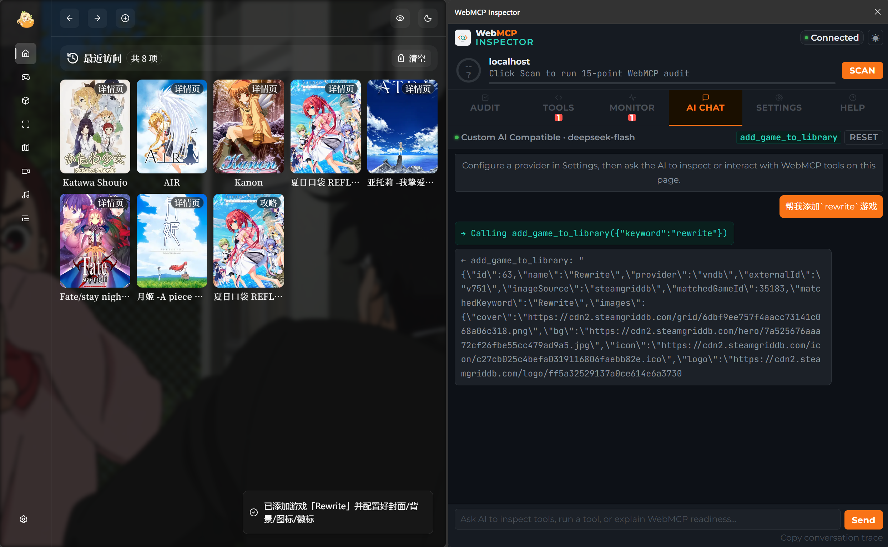
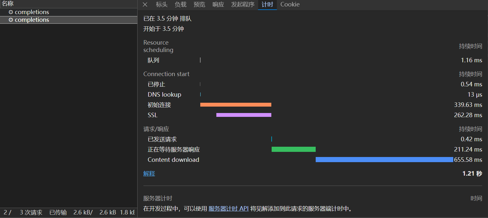

# 前言

MCP一般都是运行在服务端的，一般都需要启动一个后端程序，而且一般都在本地；而WebMCP则是在客户端，这里的WebMCP Tools由网站的开发者自己开发和维护。

出发点是为了方便AI对Web应用进行操作。以买东西为例，从找商品、加入购物车到购买和支付，其实都可以由程序来执行，尤其是在肯德基、瑞幸、蜜雪这些商品名称不一致的餐饮店。早期的豆包手机我不知道是什么原理，大概主要还是靠图像理解吧，也能自主完成下单，但效果肯定不如理想中的MCP那么方便、那么高效。

> 腾讯好像也在搞WebMCP了。试想一下，如果微信接入了AI Agent，可以访问所有的微信小程序，而像KFC、蜜雪这些小程序都做了WebMCP，支付方式又是微信支付的话，可能和AI对话了不到10秒，就已经下单并支付成功了。如果后续还支持用户自定义定时任务，比如每天早上八点都要来一杯美式，那就很方便了。预测一下，明年小程序一定会非常火。

我之前在搞的vnweb，添加游戏的过程有点繁琐：

1. 选择Provider
2. 输入关键字并搜索
3. 从搜索结果里找到游戏
4. 在游戏设置页面分别在SGDB上搜索封面、背景、图标和徽标

正好借此来尝尝鲜。理想情况下，上述操作要是用WebMCP实现，应该只需要1秒。

::github{repo="Halory-Ito/vnweb"}

# 思路

WebMCP的思路，是让网页把自己能做什么注册成一个个工具，AI Agent发现之后直接调用，而不是去截图、猜按钮、模拟点击。

核心就一个东西：​`document.modelContext`。往上面注册工具即可：

```js
await document.modelContext.registerTool({
  name: "page-title",
  description: "获取当前页面标题",
  inputSchema: { type: "object", properties: {} },
  execute() {
    return { title: document.title };
  },
});
```

一个工具包含几个关键字段：

- `name`​：唯一标识，长度1~128，只能用字母数字和​`_ - .`
- `description`：写给AI看的自然语言说明，AI靠它决定用不用这个工具，很关键
- `inputSchema`：JSON Schema，描述入参长什么样
- `execute`：真正干活的函数
- `annotations`：可选，告诉AI这工具是不是只读、有没有严重后果之类的

除了注册，还有​`getTools()`​（列出工具）和​`executeTool()`​（执行某个工具）。注册时可以传一个​`AbortSignal`​来控制注销。另外还能给​`<form>`​加​`toolname`之类的属性做声明式注册，不过我这里用的是命令式那套。

这套规范目前还是W3C社区组的草案（Draft Community Group Report），Chrome也只是实验阶段，所以实际做的时候需要配一个polyfill兜底。

React项目里我用了两个包：

- [`usewebmcp`](https://www.npmjs.com/package/usewebmcp)：把工具跟组件生命周期绑起来的Hook，卸载时自动注销
- [`@mcp-b/webmcp-polyfill`](https://www.npmjs.com/package/@mcp-b/webmcp-polyfill)：浏览器没有原生实现时补上运行时，比如Firefox就不支持

`usewebmcp`​有一个我比较喜欢的地方：它只用JSON Schema、不做校验，但能从schema的​`as const`​字面量推导出入参的TypeScript类型。写代码时​`input.keyword`是什么类型一清二楚，字段写错会直接编译报错。

# 添加tool

我想要的功能很明确：给一个游戏名，自动搜索、匹配、加进游戏库，顺便把封面、背景、图标、徽标都配好。

## 目录结构

WebMCP的运行时是通用的，放根级​`lib/webmcp/`​；具体工具属于游戏模块，收在​`features/game/webmcp/`：

```
lib/webmcp/                     # 通用运行时（其它模块以后也能用）
features/game/webmcp/
├── components/game-webmcp-tools.tsx   # 只注册，不渲染
├── hooks/use-add-game-tool.ts         # 业务逻辑
└── lib/
    ├── add-game-tool-schema.ts        # JSON Schema
    └── fetch-game-images.ts           # 去SGDB抓图
```

之所以不单独建一个​`features/webmcp/`，是因为这个项目里feature之间是零相互引用的，而工具要调用游戏模块的搜索、入库接口，放到独立feature里反而会破坏这条约定。所以运行时上提成公共的，工具留在它所属的域内。

## 注册polyfill

`usewebmcp`​在注册的时候会立刻去读​`document.modelContext`，它不会等你事后装好的运行时，所以polyfill一定要在工具注册前装。

我抽了一个幂等的小函数：

```ts
// lib/webmcp/runtime.ts
import { installWebMCP } from "@mcp-b/webmcp-polyfill";

let installed = false;

export function ensureWebMcpRuntime() {
  if (installed || typeof window === "undefined") return; // SSR或已装过，跳过
  installWebMCP();
  installed = true;
}
```

然后在客户端组件的模块顶层就调用它，模块求值一定发生在Hook挂载之前：

```tsx
"use client";

import { ensureWebMcpRuntime } from "@/lib/webmcp";
import { useAddGameTool } from "@/features/game/webmcp/hooks/use-add-game-tool";

ensureWebMcpRuntime(); // 必须在useWebMCP注册之前

export const GameWebMcpTools = () => {
  useAddGameTool();
  return null;
};
```

## 定义tool

```ts
// features/game/webmcp/lib/add-game-tool-schema.ts
export const ADD_GAME_TOOL_NAME = "add_game_to_library";

export const addGameToolInputSchema = {
  type: "object",
  properties: {
    keyword: { type: "string", description: "游戏名称关键词，用于在数据源中搜索" },
    provider: {
      type: "string",
      description: "数据源id，例如vndb、bangumi、steam、steamgriddb；留空默认vndb",
    },
    externalId: { type: "string", description: "已知的数据源游戏ID；提供后跳过搜索，直接用这个ID" },
    imageSource: { type: "string", description: "图片来源，默认steamgriddb" },
  },
  required: ["keyword"],
} as const;
```

`description`建议认真写，因为AI选不选这个工具、参数怎么填，很大程度上看它。

## 发现tool

整个流程就是：搜索→取详情→入库→抓图→写回→刷新缓存。

```ts
// features/game/webmcp/hooks/use-add-game-tool.ts（节选）
export const useAddGameTool = () => {
  const queryClient = useQueryClient();
  const router = useRouter();

  useWebMCP({
    name: ADD_GAME_TOOL_NAME,
    description: "搜索游戏并自动添加到游戏库，同时从SteamGrid DB获取并配置封面、背景、图标和徽标。",
    inputSchema: addGameToolInputSchema,
    annotations: { readOnlyHint: false }, // 会改数据，明确告诉AI不是只读
    execute: async (input) => {
      const keyword = (input.keyword ?? "").trim();
      if (!keyword) throw new Error("请提供游戏名称关键词keyword");

      const provider = resolveProvider(input.provider);
      const imageSource = (input.imageSource ?? "").trim() || DEFAULT_GAME_IMAGE_SOURCE;

      // 1. 搜索（或按externalId直接识别）→ 取详情
      let externalId = (input.externalId ?? "").trim();
      let gameInfo = null;
      if (externalId) {
        gameInfo = await getGameInfoByIdApi(externalId, provider);
      } else {
        const result = await searchGameByNameApi(keyword, provider, 0, 1);
        const first = result.items[0];
        if (!first) throw new Error(`在数据源「${provider}」里没搜到「${keyword}」`);
        externalId = first.id;
        gameInfo = await getGameInfoByIdApi(first.id, provider);
      }
      if (!gameInfo?.name) throw new Error("没拿到游戏详情");

      // 2. 入库
      const created = await createGameInfoApi(gameInfo, { provider, externalId });
      const gameId = created?.data?.id;
      if (!gameId) throw new Error("游戏创建失败");

      // 3. 抓图（见下一节）
      const imageResult = await fetchGameImages({ gameInfo, keyword, source: imageSource });
      const images = { ...imageResult.images };
      if (!images.cover && gameInfo.cover.trim()) images.cover = gameInfo.cover.trim();

      // 4. 写回 + 刷新前端缓存
      if (Object.keys(images).length > 0) await updateGameInfoById(gameId, images);
      await queryClient.invalidateQueries({ queryKey: ["game"] });
      await queryClient.invalidateQueries({ queryKey: ["game-cards"] });
      await queryClient.invalidateQueries({ queryKey: ["game-sidebar"] });

      return { id: gameId, name: gameInfo.nameCn || gameInfo.name, provider, images };
    },
  });
};
```

默认数据源我选了VNDB，但这里有个细节不能写死，因为数据源是插件化的，用户可以在设置里禁用：

```ts
const DEFAULT_GAME_PROVIDER = "vndb";

const resolveProvider = (requested?: string) => {
  const options = getManualSearchProviderOptions(); // 已启用的手动搜索数据源
  const value = requested?.trim();

  if (value) {
    if (!options.some((o) => o.value === value)) {
      throw new Error(
        `不支持的数据源「${value}」，可选：${options.map((o) => o.value).join("、")}`,
      );
    }
    return value;
  }
  // 优先VNDB，被禁用了就退回到第一个可用数据源
  if (options.some((o) => o.value === DEFAULT_GAME_PROVIDER)) return DEFAULT_GAME_PROVIDER;
  return options[0]?.value ?? DEFAULT_GAME_PROVIDER;
};
```

## 全局挂载

工具要挂在全局（任意页面都能被AI发现），所以我把它放进了根布局：

```tsx
// app/layout.tsx
<AppLayout>{children}</AppLayout>
<GameWebMcpTools />
<Toaster />
```

# 测试

Chrome和Edge可以借助​`WebMCP Inspector`​这个插件来发现和使用WebMCP，这里以​`rewrite`为例，通过和Agent对话来实现MCP的调用：



很顺利，然后再来看看执行时间，也是很快的，只用了一秒多钟，如果网速再快点，或者使用本地模型的话，基本连1秒都不需要



> 既然WebMCP是位于客户端的，那么就不要想着让你本地的OpenCode发现这个MCP了

# 总结

个人感觉还是很好用的，以后必定是Web的未来，🤪前端永生
