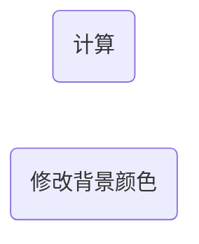

JavaScript是一种单线程编程语言，这便意味着不论你电脑配置有多高，JS只会用单核CPU来执行任务，其余cores基本都会处在闲置状态

但是事件循环（event loop）解决这这种限制，事件循环最重要的一点就是非阻塞

举一个实际的例子，假设页面中有两个按钮，其中一个用来进行IO密集的计算，另外一个用于修改页面的背景颜色。如果我们先点击“计算”的按钮，再点击“修改背景颜色”的话，会出现什么情况呢？只要计算量够大，就会出现等待很长一段时间之后，背景颜色才会被修改



这显然是很糟糕的，而Web Workers就可以把IO密集的计算任务交给一个新的线程执行，无需占用主进程，做法如下：

1. 在主进程脚本中创建一个`worker`对象

```js
// 这里的 worker.js 中写了我们要完成的IO密集任务
const worker = new Worker("worker.js");
```

2. 通过绑定点击事件，来触发 worker 执行任务

```js
const totalButton = document.getElementById("total");

totalButton.addEventListener("click", () => {
  worker.postMessage("Hello worker");
});
```

3. 将IO密集任务写入 `worker.js` 中

```js
// 这里的 message.data 就是上面的 `Hello worker`
onmessage = function (message) {
  console.log(message);
  console.log("Worker has started working");
  let total = 0;
  for (let i = 1; i <= 10000000000; i++) {
    total += 1;
  }
  console.log("Worker has finished working");

  // 计算完成后，将数据传递给主进程
  this.postMessage(total);
};
```

4. 从 `worker` 获取计算结果

```js
worker.onmessage = function (message) {
  console.log(`The total is ${message.data}`);
};
```

因此总结一下 Web Worker 的使用场景：

- 图片/视频处理、编解码
- 大数据排序、解析（如 JSON 解析、CSV 处理）
- 加密、压缩、Canvas 渲染
- 防止复杂计算阻塞 UI 交互
