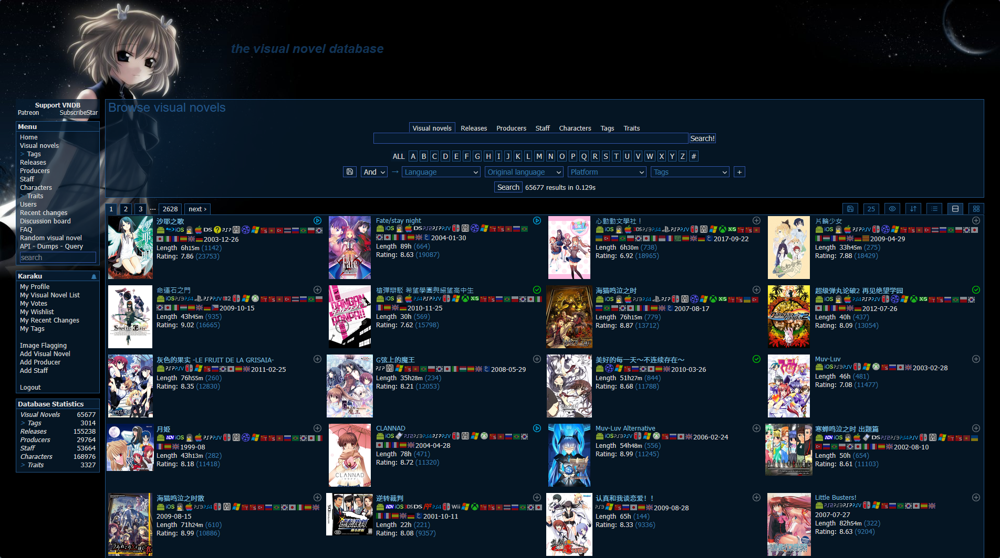
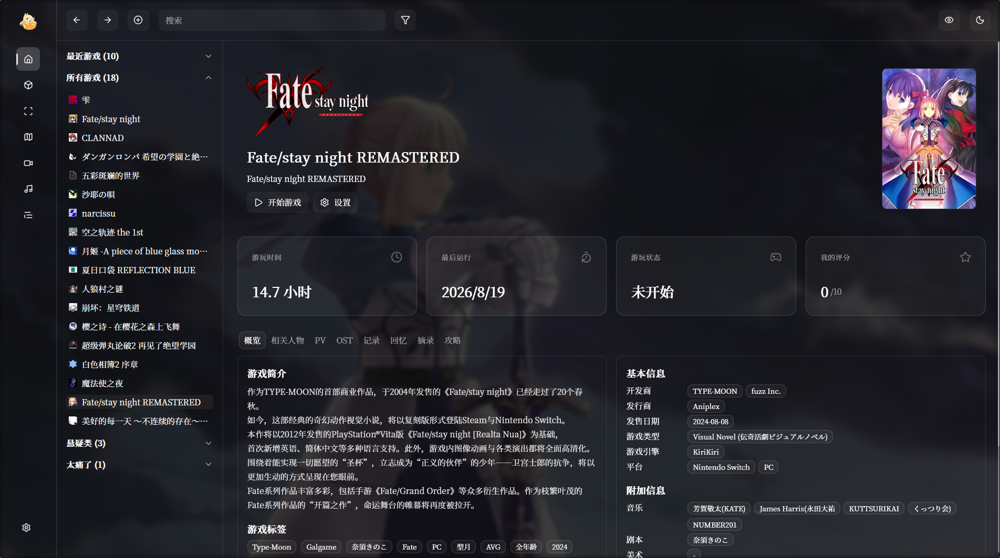

# 概述

视觉小说是很有沉浸感的一类游戏，如果你~~也没有朋友~~喜欢独处，挑一个时间点，在没有人打扰的地方，拉上窗帘，开启一盏暖灯，备好一杯奶茶或者果汁，戴着耳机，看着游戏剧情，欣赏着日系音乐、精彩的配音以及精美的游戏CG，沉溺其中，绝对是一种舒适的体验。

下面我主要介绍一下我平常游玩视觉小说用到的网站或者工具

# 找游戏

视觉小说那么多，到底要玩哪一款呢？对，我们需要一个数据库，目前最大的视觉小说数据库应当是[VNDB](https://vndb.org)，这里提供了最全的视觉小说信息，甚至还有游戏评分、游玩时长等信息，很容易就能找到一款玩起来感觉还不错的游戏

如果没有电脑或者平板，访问网站不是太方便的，或者觉得网站页面不够简约的话，那么可以安装下面的VNDB第三方客户端

::github{repo="Daniel-C-J/vndb-lite"}

如果觉得英文不适应，用起来不方便的话，也有一些中文的视觉小说资料网站，主要有：

- [CnGal](https://www.cngal.org/)
- [月幕](https://www.ymgal.games/)

这两个网站除了提供基本的游戏信息之外，还有其他二次元伙计写的文章、杂谈，或许可以帮助更好地选择游戏

# 找资源

~~穷人看过来，富婆少爷可以走开了~~

知道要玩什么游戏后，下一步就是获取游戏实体了，正常获取游戏一般都是在官网或者在主流的游戏平台购买，我也是支持购买正版的，只不过很多正版并没有提供本土语言，让我不得不去社区寻找翻译组制作的版本（汉化组是神）

我找游戏的渠道一般有如下四个：

- [真红小站](https://www.shinnku.com/)
- [TouchGal](https://www.touchgal.ink)
- [月谣](https://www.sayafx.vip/)
- [聚合搜索](https://www.searchgal.top)

如果再找不到的话，那只能去寻求社区帮助、去网盘资源网站搜索了，或许还会有意想不到的收获

> 真实经历，我当初想找一个月姬R的任天堂游戏实体，但是找到的汉化版本不支持版本比较高的模拟器，楔子部分过完后就出现了画面撕裂的情况。于是我就去一些网盘资源网站，你猜怎么着，我直接找到了月姬R的官方中文版游戏实体，这样就支持最新的模拟器了

# 游戏工具

下一步就是要玩游戏了，但只是双击exe文件就可以了吗？确实可以，不过我觉得可以再做一些游玩体验的优化

## 游戏管理

如果游戏过多的话，那么整理起来也不方便，并且面对的如果是文件夹大军的话，也不好看，那么我非常建议在本地用一个专门的工具进行游戏管理，比较推荐的是vnweb

::github{repo="Halory-Ito/vnweb"}

vnweb支持的内容非常多，包括：

- 游戏基本信息管理（支持从vndb、bangumi、steam、ymgal等平台获取数据）
- 游戏PV和OST管理（支持从网易云添加游戏的OST、支持将视频链接或者B站链接和游戏进行绑定，即PV）
- 游戏角色和台词管理（如果遇到印象深刻的对话或者句子，可以随时记录保存；人物信息也可以快速进行查阅）
- 游戏攻略（可以随时标记游戏进度，支持从[悠久](https://www.yjgalgame.com/)导入攻略，支持自定义攻略，还可以利用网站提供的提示词借助ai来快速生成游戏攻略）
- 游玩统计（记录每一次游戏时长，根据记录信息生成年报、月报等统计内容）
- 游戏扫描（可以自动将文件夹中的游戏扫描添加到系统中）
- 游戏自动存档（每一次游戏结束后，都可以自动将游戏存档进行备份）
- 自定义外观（包括字体、背景图片、蒙版模糊度和透明度、CSS样式、深浅模式等）
- 命令行工具（日常玩游戏的话，可以直接打开命令行，输入`vnweb start`就可以启动上一次的游戏了）

所以用起来吧！

## 游戏全屏和图像优化

有些老游戏不支持全屏，或者全屏之后游戏的画质会很差，那么就可以使用Magpie，它是一个轻量级的窗口超分辨率工具，内置众多高效的算法和滤镜，仓库地址如下，具体使用可以参考文档或者去B站搜索配置教程

::github{repo="Blinue/Magpie"}
